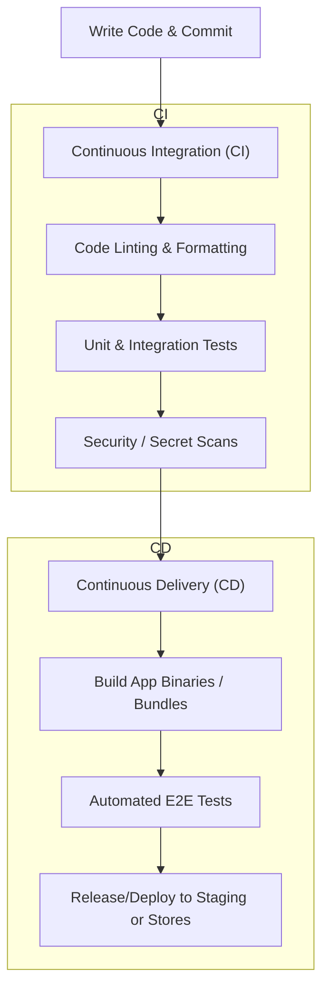

# 🚀 Continuous Integration & Continuous Deployment (CI/CD)

CI/CD is a cornerstone of modern software development, especially for mobile applications. This document covers what CI/CD is, its uses, an analysis of the CI/CD pipeline inside the **Asthma Australia App** project, and a guide on how to integrate CI/CD into this `ExpoStructure` project.

---

## 📋 Table of Contents

1. [What is CI/CD?](#-what-is-cicd)
2. [CI/CD in the Asthma Australia App Project](#-cicd-in-the-asthma-australia-app-project)
3. [How to Add CI/CD to Your Expo Project](#-how-to-add-cicd-to-your-expo-project)
4. [Detailed Line-by-Line Pipeline Analysis](#-detailed-line-by-line-pipeline-analysis)
5. [Key Differences at a Glance](#-key-differences-at-a-glance)

---

## 💻 What is CI/CD?

CI/CD stands for **Continuous Integration** and **Continuous Delivery** (or **Continuous Deployment**). It is a method of delivering apps to users frequently by introducing automation into the stages of app development.

### 🔍 Core Concepts

- **Continuous Integration (CI):** Developers merge their code changes back to the main branch as often as possible.
  - **The Process:** Every push or Pull Request triggers an automated script that checks out the code, installs dependencies, runs linters, and executes tests.
  - **Goal:** Detect bugs, syntax errors, and integration problems early before they get merged.
- **Continuous Delivery (CD):** Automatically prepares code changes for a release to production. Once builds pass testing, they are ready to be deployed at the click of a button.
- **Continuous Deployment (CD):** Automates the entire release cycle. Every change that passes all stages of your production pipeline is released to your users automatically without human intervention.

### 🌟 Key Uses & Benefits

- **Accelerated Releases:** Release new features and bug fixes rapidly.
- **Reduced Risk:** Automated tests catch regressions and bugs before they reach the user.
- **Reduce Human Error:** Automate repetitive tasks like compiling code, signing iOS/Android packages, and uploading assets.
- **Fast Feedback Loop:** Developers instantly know if their commits broke any tests or styling guidelines.
- **Consistency:** Eliminates the "works on my machine" problem by building code in uniform, isolated cloud environments.
- **Automated Store Deliveries:** Submitting builds manually to Apple App Store (TestFlight) or Google Play Store is slow and error-prone; CD completely automates this.
- **Consistently High Quality:** Automated unit, integration, and E2E tests serve as gates that prevent buggy code from making it to production.

---

## 📱 CI/CD in the Asthma Australia App Project

The **Asthma Australia App** is a real-world, production React Native/Expo app. Examining its structure shows a highly advanced CI/CD setup.

### Why is it used?

Mobile distribution is complex. Building binaries requires platform-specific toolchains (Xcode/macOS for iOS, Android SDK/Gradle for Android), signing certificates, and manual uploads to App Store Connect / Google Play Console. The project utilizes CI/CD to automate:

- **Linting & Code Formatting:** ESLint, Prettier, and TypeScript validations.
- **Unit Testing:** Runs Jest tests on code push.
- **E2E UI Testing:** Employs **Maestro** to run flow-based automated testing on actual iOS/Android simulator builds before publishing.
- **Semantic Versioning:** Automates app version increments and updates the `package.json`, `app.json`, and `CHANGELOG.md` upon releases.
- **Web Deployments:** Compiles web bundles and automatically deploys them to AWS S3/CloudFront.

### How is CI/CD Implemented Here?

The app uses a **Bitbucket Pipelines** CI/CD runner combined with **EAS (Expo Application Services)** and a helper CLI called `@radhya/mach`.

Key files involved:

1. **[bitbucket-pipelines.yml](file:///Users/darshan/Documents/Projects/ReactNative/Zyrous/asthma-australia-app/bitbucket-pipelines.yml):**
   This file defines the pipeline rules, triggers, and execution steps. It is broken down as follows:
   - **Pull Requests:** Runs security-scan (checks for leaked secrets), linting (ESLint and TS checking), and unit-tests (Jest tests) in parallel to ensure incoming code is clean.
   - **`develop` branches:** Deploys the web app to S3, builds Android/iOS staging clients, and runs code coverage reporting.
   - **`staging` branches:** Deploys web, runs staging E2E tests using Maestro, and compiles mobile builds.
   - **`main` (Production) branch:** Triggers the production release process including semantic versioning, building production binaries, and submitting them to the App Stores.
2. **[mach.config.json](file:///Users/darshan/Documents/Projects/ReactNative/Zyrous/asthma-australia-app/mach.config.json):**
   - Defines bundle identifiers (com.connect.asthma).
   - Establishes different build profiles like debug-sim (iOS simulator variant), debug (Android emulator variant), e2e-staging, staging, and production.
   - Maps each profile to its environment and credentials.
3. **[eas.json](file:///Users/darshan/Documents/Projects/ReactNative/Zyrous/asthma-australia-app/eas.json):**
   This configures Expo Application Services (EAS) directly, mapping profiles like development, preview, and production with node versions and release channels.

---

## 🛠️ How to Add CI/CD to Your Expo Project

If you want to add CI/CD to a React Native / Expo application like your own workspace (e.g. `RN_Basic_Structure`), you can set it up via GitHub Actions.

If your repository is hosted on GitHub, you can create a file named `.github/workflows/ci.yml` in your project root to handle standard linting, typechecking, tests, and EAS cloud deployment.

GitHub Actions workflow at the root of the workspace: **[.github/workflows/ci.yml](file:///Users/darshan/Documents/Projects/Products/RN_Basic_Structure/.github/workflows/ci.yml)**.

This workflow handles both **ExpoStructure** and **ReactNativeCliStructure** dynamically depending on which files are modified.

---

### ⚙️ How the Workflow is Configured

The workflow is broken down into three logical jobs:

#### 1. Expo Structure validation (`expo-ci`)

- **Trigger condition:** Automatically runs when files inside `ExpoStructure/**` are modified, or on a direct push to `main` / `develop`.
- **Execution:**
  1. Sets up Node.js v20 with dependency caching.
  2. Runs `npm ci` inside `ExpoStructure`.
  3. Runs code styling/validation with `npm run lint`.
  4. Runs Expo's configuration validator using `npm run doctor`.

#### 2. React Native CLI validation (`rn-cli-ci`)

- **Trigger condition:** Automatically runs when files inside `ReactNativeCliStructure/**` are modified, or on a direct push to `main` / `develop`.
- **Execution:**
  1. Sets up Node.js v22 with dependency caching.
  2. Runs `npm ci` inside `ReactNativeCliStructure`.
  3. Runs linter with `npm run lint`.
  4. Runs Jest test suite with `npm run test`.

#### 3. EAS Build Orchestration (`eas-build`)

- **Trigger condition:** Automatically runs on pushes to `develop` (staging) or `main` (production).
- **Execution:**
  1. Logs into EAS using the configured `EXPO_TOKEN` secret.
  2. Runs a cloud build for Android and iOS using the specified profiles (`staging` or `production`).

---

### 🔑 Setting up the EAS Integration (How to Use)

To make the automated cloud builds work:

1. **Get an Expo Token:**
   - Go to [expo.dev](https://expo.dev) -> account settings -> Access Tokens -> Generate a new token.
2. **Add the Secret to GitHub:**
   - Open your repository on GitHub.
   - Go to **Settings** -> **Secrets and variables** -> **Actions** -> **New repository secret**.
   - Name: `EXPO_TOKEN`
   - Value: _Paste your generated Expo Access Token_.
3. **Push to GitHub:**
   - Once the secret is added, every push to `develop` or `main` will trigger the corresponding staging/production build in EAS.

---

## 🔍 Detailed Line-by-Line Pipeline Analysis

Below is a detailed, line-by-line explanation of the CI/CD pipelines in both projects: **RN Basic Structure** (using GitHub Actions) and **Asthma Australia / Asthma Connect** (using Bitbucket Pipelines).

### 1. RN Basic Structure Pipeline

- **File Location**: [.github/workflows/ci.yml](file:///Users/darshan/Documents/Projects/Products/RN_Basic_Structure/.github/workflows/ci.yml)
- **Platform**: GitHub Actions
- **Target Architecture**: Monorepo style containing separate sub-folders for an Expo structure (`ExpoStructure`) and a React Native CLI structure (`ReactNativeCliStructure`).

#### Block-by-Block & Line-by-Line Breakdown

| Lines       | Code Snippet / Context                                        | Description & Purpose                                                                                                                                                                                                                          |
| :---------- | :------------------------------------------------------------ | :--------------------------------------------------------------------------------------------------------------------------------------------------------------------------------------------------------------------------------------------- |
| **1**       | `name: Continuous Integration & Deployment (CI/CD)`           | Defines the name of this workflow that will display in the GitHub Actions sidebar.                                                                                                                                                             |
| **3–7**     | `on: push: branches: [main, develop] pull_request: ...`       | **Triggers**: Dictates when the pipeline automatically starts. It runs on any direct push or pull request targeted at the `main` (production) or `develop` (staging) branches.                                                                 |
| **9–16**    | `jobs: expo-ci: name: Expo Structure CI outputs: ...`         | **Job 1 (Expo Validation)**: Defines a job named `expo-ci` that runs on a clean Ubuntu runner. It exports an output called `expo_changed` to be referenced by downstream jobs.                                                                 |
| **18–19**   | `- name: 📥 Checkout repository uses: actions/checkout@v4`    | Checks out the project code so that the virtual runner has access to compile it.                                                                                                                                                               |
| **21–27**   | `- name: 🔍 Detect Changes id: filter ...`                    | Uses `paths-filter` to optimize performance. It checks if files inside the `ExpoStructure/` folder changed and saves the result as `steps.filter.outputs.expo`.                                                                                |
| **29–35**   | `- name: 🟢 Setup Node.js uses: actions/setup-node@v4 ...`    | Installs Node.js v20. It runs conditionally (`if`) only if files inside `ExpoStructure` changed or if this was a direct branch push. It automatically caches packages using the `package-lock.json` checksum as a key to speed up build times. |
| **37–41**   | `- name: 📦 Install Dependencies run: cd ExpoStructure ...`   | Installs node modules under the `ExpoStructure` folder. It uses `npm ci` (Clean Install), which is faster and cleaner for continuous integration environments than `npm install`.                                                              |
| **43–47**   | `- name: 🧹 Run Lint & Type Checks run: cd ExpoStructure ...` | Runs automated ESLint and/or TypeScript configuration checking for code syntax compliance.                                                                                                                                                     |
| **49–53**   | `- name: 🏥 Run Expo Doctor run: cd ExpoStructure ...`        | Executes `expo-doctor` to analyze Expo configuration files (`app.json`, packages) and verify dependency health/compatibility.                                                                                                                  |
| **55–59**   | `rn-cli-ci: name: React Native CLI Structure CI ...`          | **Job 2 (React Native CLI Validation)**: Defines a job to test the React Native CLI setup folder, running on Ubuntu.                                                                                                                           |
| **60–70**   | `uses: actions/checkout@v4` / `uses: dorny/paths-filter@v3`   | Performs checkout and inspects if files in the `ReactNativeCliStructure/` subfolder have changed.                                                                                                                                              |
| **71–77**   | `- name: 🟢 Setup Node.js uses: actions/setup-node@v4 ...`    | Sets up Node.js v22 (representing a newer Node version for CLI structure dependency profile) and configures caching for its specific dependencies.                                                                                             |
| **79–83**   | `- name: 📦 Install Dependencies run: cd RN_CLI ...`          | Runs a clean install of dependencies inside `ReactNativeCliStructure`.                                                                                                                                                                         |
| **85–89**   | `- name: 🧹 Run Lint run: cd ReactNativeCliStructure ...`     | Executes the linter in the React Native CLI directory.                                                                                                                                                                                         |
| **91–95**   | `- name: 🧪 Run Unit Tests run: cd ...`                       | Runs Jest unit tests to verify that standard code behaviors are intact.                                                                                                                                                                        |
| **97–103**  | `eas-build: name: Trigger EAS Build needs: [expo-ci] ...`     | **Job 3 (EAS Deployment Build)**: Triggers Expo Application Services (EAS) cloud builds. It depends on `expo-ci` succeeding first and only fires on direct branch pushes to `main` or `develop`.                                               |
| **104–114** | `actions/checkout@v4` / `actions/setup-node@v4`               | Prepares the code and Node.js environment to submit build details.                                                                                                                                                                             |
| **115–120** | `- name: Setup EAS uses: expo/expo-github-action@v8 ...`      | Installs the EAS command-line tools. It authenticates with Expo Cloud Services using a secure token (`EXPO_TOKEN`) fetched from GitHub repository Secrets.                                                                                     |
| **122–125** | `- name: 📦 Install Dependencies`                             | Installs the node modules required to run configuration compilation step scripts locally before uploading to EAS.                                                                                                                              |
| **127–131** | `- name: 🚀 Trigger EAS Staging Build`                        | If pushed to the **`develop`** branch, it instructs EAS to build staging binaries for all platforms (iOS + Android) using the `staging` build profile.                                                                                         |
| **133–138** | `- name: 🚀 Trigger EAS Production Build & Submit`            | If pushed to the **`main`** branch, it triggers production builds on EAS and automatically submits the generated binaries to the Apple App Store Connect and Google Play Console (`--auto-submit`).                                            |

---

### 2. Asthma Connect Project Pipeline

- **File Location**: [bitbucket-pipelines.yml](file:///Users/darshan/Documents/Projects/ReactNative/Zyrous/asthma-australia-app/bitbucket-pipelines.yml)
- **Platform**: Bitbucket Pipelines
- **Target Architecture**: Single React Native Expo project structure using `@radhya/mach` (an EAS build/submission wrapper) and automated Maestro E2E UI tests.

#### Global Configuration & Caches

- **Line 1 (`image: node:24.13.1`)**: Defines the global Docker container image in which all pipeline build steps will run.
- **Lines 3–9 (`definitions: caches: npm: ...`)**: Declares custom caching rules for `npm`. It evaluates `package-lock.json` to check if node modules need downloading or can be loaded from cache (`~/.npm`).

#### Step Templates (Anchor Declarations)

Bitbucket utilizes YAML anchors (`&name`) to declare steps that can be referenced (`*name`) later.

| Line        | Step Name                  | Description & Purpose                                                                                                                                                                                                                        |
| :---------- | :------------------------- | :------------------------------------------------------------------------------------------------------------------------------------------------------------------------------------------------------------------------------------------- |
| **12–15**   | `&security-scan`           | Runs Atlassian’s security scan pipe (`git-secrets-scan`) to identify committed credentials, secret API keys, or certificates.                                                                                                                |
| **17–23**   | `&linting`                 | Performs a clean install (`npm ci`) and runs static analysis checking code formatting constraints (`npm run lint`).                                                                                                                          |
| **25–32**   | `&unit-tests`              | Runs unit tests inside a double-resourced container (`size: 2x` gives 8GB RAM for high performance) with Jest.                                                                                                                               |
| **34–42**   | `&test-coverage`           | Runs tests, generates a test coverage report (`lcov.info`), and sends this information directly to Codacy's security/analysis dashboard.                                                                                                     |
| **44–50**   | `&semantic-release`        | Analyzes commit history to automatically bump versions, create git release tags, and write automated changelogs.                                                                                                                             |
| **52–74**   | `&build-ios`               | Compiles the iOS binary on EAS Cloud using `@radhya/mach`. It extracts the build URL from output JSON, calls a shell script to extract commit log updates, constructs a custom Slack notification, and pushes it to a Slack channel webhook. |
| **75–97**   | `&build-android`           | Identical to iOS compilation above, but compiles and releases for Android.                                                                                                                                                                   |
| **98–105**  | `&submit-android`          | Submits the latest successful Android bundle to the Google Play Store using the selected profile via the `mach submit` command.                                                                                                              |
| **106–114** | `&submit-ios`              | Submits the latest successful iOS binary to Apple TestFlight/App Store via `mach submit`.                                                                                                                                                    |
| **116–126** | `&maestro-e2e-ios`         | Triggers a custom simulator-compatible iOS test build and runs automated user flows via Maestro (stored under `.maestro/` folder).                                                                                                           |
| **127–137** | `&maestro-auth-e2e-ios`    | Runs authenticated flows in `.maestro-authenticated/` by parsing secure login credentials (MFA Key, Test User Email/Password) from pipeline settings.                                                                                        |
| **138–163** | `&maestro-e2e-ios-staging` | Specialized staging automated test execution step. If Maestro tests fail, it terminates the script execution cleanly (`set +e` controls errors) and saves screen-recording outputs.                                                          |
| **164–183** | `&deploy-web`              | Builds the React web distribution (`npm run build:web`), uploads the production bundle (`dist/`) directly to AWS S3, and triggers a CloudFront CDN invalidation step so users immediately see updates.                                       |

#### Pipelines Triggers & Execution Blocks

| Lines       | Pipeline Trigger | Steps Executed                                                     | Use Case                                                                                                                                       |
| :---------- | :--------------- | :----------------------------------------------------------------- | :--------------------------------------------------------------------------------------------------------------------------------------------- |
| **185–191** | `default`        | Security Scan, Linting, Unit Tests                                 | Runs on temporary feature branches to ensure they are safe and compile cleanly.                                                                |
| **193–200** | `pull-requests`  | Linting, Unit Tests                                                | Executed on open pull requests to block merges if tests fail.                                                                                  |
| **201–207** | `custom`         | Manual select menus in Bitbucket interface.                        | Exposes buttons for manually executing Maestro End-to-End iOS test suites.                                                                     |
| **209–218** | `develop`        | Web Deployment, Android Build, iOS Build, Coverage                 | Runs when code merges into **`develop`**. Builds staging applications and uploads to staging services.                                         |
| **220–228** | `staging`        | Staging Maestro Tests, Android Build, iOS Build, Web Deployment    | Runs on the **`staging`** branch. Validates release candidates using staging environments.                                                     |
| **230–241** | `main`           | Semantic Release, Web Deployment, Android/iOS Builds & Submissions | Runs when code merges into **`main`**. Packages production builds, automates version tagging, and submits directly to Apple and Google stores. |

---

## 📊 Key Differences at a Glance

| Feature / Detail       | RN Basic Structure ([ci.yml](file:///Users/darshan/Documents/Projects/Products/RN_Basic_Structure/.github/workflows/ci.yml)) | Asthma Connect ([bitbucket-pipelines.yml](file:///Users/darshan/Documents/Projects/ReactNative/Zyrous/asthma-australia-app/bitbucket-pipelines.yml)) |
| :--------------------- | :--------------------------------------------------------------------------------------------------------------------------- | :--------------------------------------------------------------------------------------------------------------------------------------------------- |
| **Platform**           | GitHub Actions                                                                                                               | Bitbucket Pipelines                                                                                                                                  |
| **Structure Context**  | Multi-project workspace (Expo vs. CLI)                                                                                       | Single application code repository                                                                                                                   |
| **Smart Re-runs**      | Runs checks only on modified directories (via `paths-filter`)                                                                | Runs global build steps based on branch matching                                                                                                     |
| **E2E Testing**        | Not defined                                                                                                                  | Integrated Maestro test execution on iOS simulators                                                                                                  |
| **Release Management** | Standard EAS compilation                                                                                                     | Semantic Release engine + Slack build notification output                                                                                            |
| **Web Infrastructure** | Not configured                                                                                                               | S3 Web build sync + AWS CloudFront cache invalidation                                                                                                |
