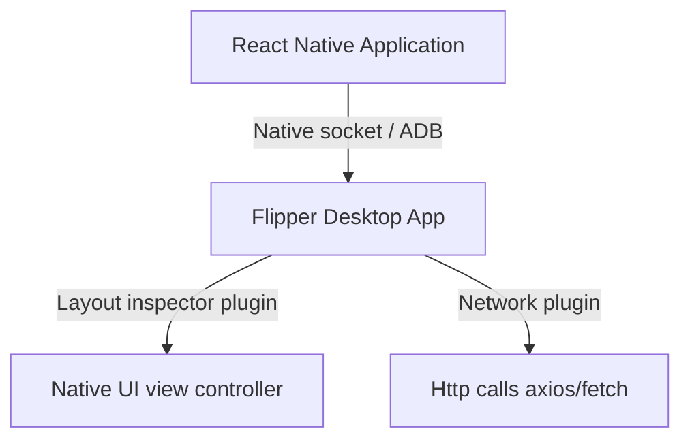
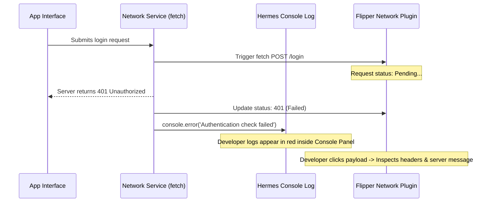

# Flipper Native Debugging

Flipper is a desktop debugging platform developed by Meta for inspecting native iOS and Android apps. It integrates both native and React Native debugging plug-ins.

> [!IMPORTANT]
> **Expo SDK 56 deprecation notice:**
> In modern React Native (SDK 56+), Flipper is deprecated and disabled by default due to issues with startup times, build size, and reliability. Expo now recommends using **Chrome DevTools (or Safari Web Inspector) for JS debugging** alongside the built-in React DevTools and network inspection in Expo CLI.
> However, understanding Flipper remains important for legacy compatibility and native device debugging.

---

## Dependencies
In custom development builds with Flipper enabled:
```bash
# Install Flipper middleware package
npm install --save-dev react-native-flipper
```

---

## Flipper Client-Server Connection Architecture



---

## Realistic Example: Tracing a Network Payload Failure

This sequence explains how developers diagnose a failed API request inside debugging console inspectors.


