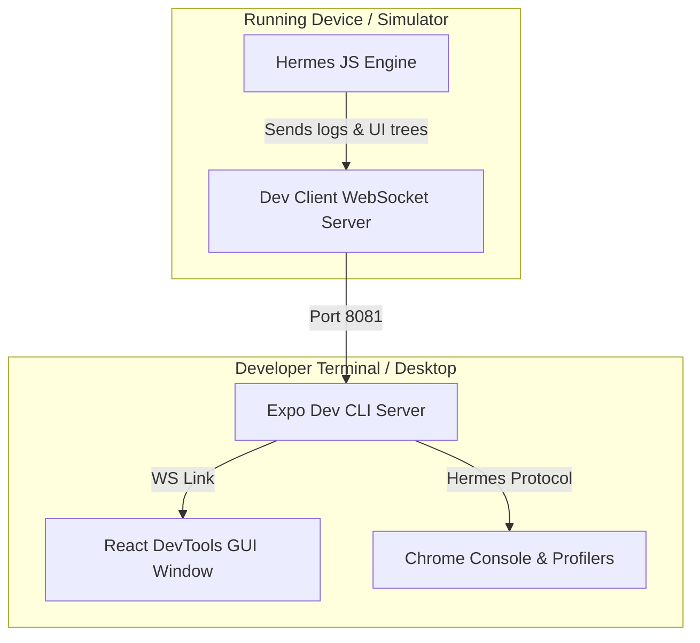

# React DevTools

React DevTools is the official debugging library for inspecting the React component hierarchy. In React Native, it connects to your running application via WebSockets.

---

## Launching Command
React DevTools is bundled within the Expo CLI developer ecosystem.

```bash
# Launch the react-devtools client globally
npx react-devtools
```

---

## Configuration & Launch Steps
1. **Start Dev Server**: Launch your Expo app server using `npx expo start`.
2. **Open Developer Menu**: Shake the physical device or press `Ctrl + Command + Z` (macOS Simulator) / `D` (Terminal) to open the Expo Dev Menu.
3. **Launch DevTools Client**: Start the client UI (`npx react-devtools`). It automatically connects to the debugging socket port.

---

## Connection Bridge Debugging Architecture



---

## Key Panels
- **Components Panel**: Inspects the virtual DOM tree, showing components, props, hooks state, and context values.
- **Profiler Panel**: Records render times and component cycles, highlighting which components re-rendered and why (e.g. state change vs. parent render).
