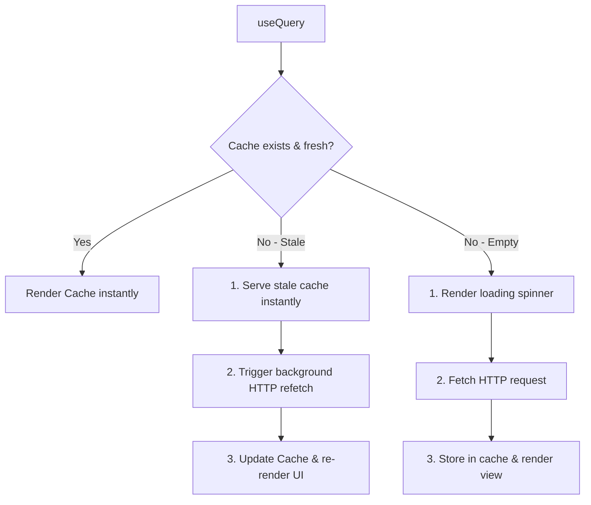
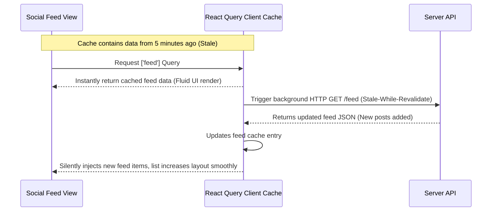
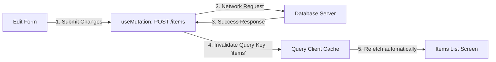

# Queries: TanStack Query (React Query)

TanStack Query (React Query) manages asynchronous server state. This guide outlines how to configure, set up cache options, invalidation flows, and utilize background refetching in React Native.

---

## Dependencies
```bash
npm install @tanstack/react-query
```

---

## Configuration & Store Providers

To enable React Query, instantiate a global `QueryClient` and wrap the root application tree in `QueryClientProvider`.

```typescript
import { QueryClient, QueryClientProvider } from '@tanstack/react-query';

const queryClient = new QueryClient({
    defaultOptions: {
        queries: {
            staleTime: 1000 * 30, // Data remains "fresh" for 30 seconds
            gcTime: 1000 * 60 * 5, // Unused cached data is garbage collected after 5 minutes
        },
    },
});

export default function AppProvider({ children }: { children: React.ReactNode }) {
    return (
        <QueryClientProvider client={queryClient}>
            {children}
        </QueryClientProvider>
    );
}
```

---

## Implementation Steps

1. **Setup Client Provider**: Wrap the main entry layout in `<QueryClientProvider>`.
2. **Implement Fetching (`useQuery`)**: Define fetch methods and bind queries using unique keys:
   ```typescript
   const { data, isLoading } = useQuery({ queryKey: ['users'], queryFn: fetchUsers });
   ```
3. **Implement Mutations (`useMutation`)**: Perform write actions (POST/PATCH/DELETE) and invalidate query caches to trigger auto-refetches:
   ```typescript
   const queryClient = useQueryClient();
   const mutation = useMutation({
       mutationFn: updateProfile,
       onSuccess: () => queryClient.invalidateQueries({ queryKey: ['profile'] }),
   });
   ```

---

## Query Cache States & Architecture Chart



---

## Realistic Example: Social Feed Post Reload

This sequence shows how client caching operates when navigating back to a social media feed, updating data silently in the background.



---

## Mutation Invalidation Cycle

When updating records on the server, the mutation automatically invalidates the fetch cache, keeping UI views synchronized.


