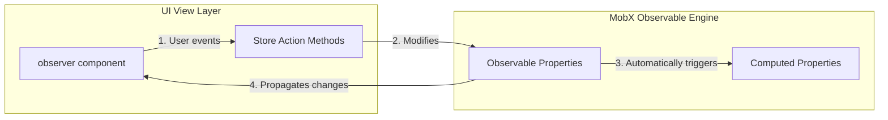
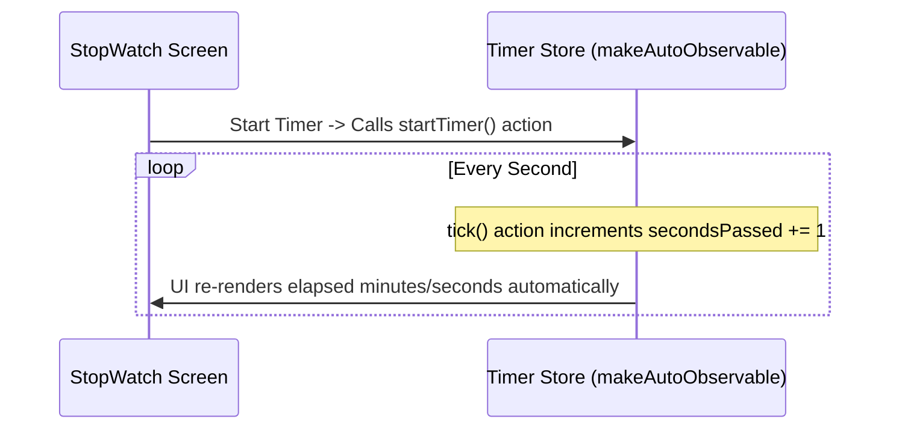

# MobX

MobX is a battle-tested state management library that applies transparent functional reactive programming (TFRP) to make state management simple and scalable. It treats application state as a spreadsheet that automatically updates cells when formulas change.

---

## Dependencies
```bash
npm install mobx mobx-react-lite
```

---

## Implementation Steps
1. **Create Store Class**: Build a JS class declaring observable properties and actions.
2. **Bind Reactivity**: Call `makeAutoObservable(this)` inside the class constructor.
3. **Reactive UI Wrap**: Wrap components with the `observer` high-order component. Components will track state updates automatically.

---

## Observable Loop Chart


---

## Realistic Example: Live Stop Watch timer

