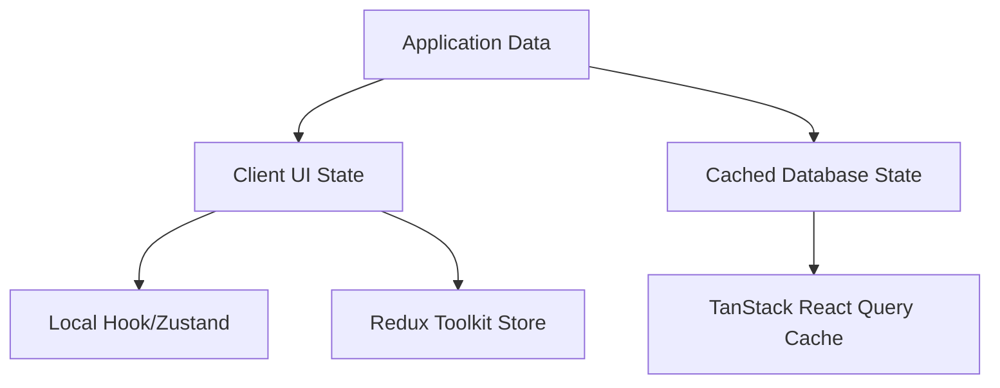

# What is State Management?

State management refers to the architectural design patterns and libraries used to manage, store, sync, and update the dynamic data (state) of an application across multiple screens and component trees.

In React Native, as the app grows, passing data through prop-drilling (from parent to nested children) becomes error-prone and hard to maintain. A state management tool acts as a single centralized container (or reactive models) that components can directly subscribe to.

---

## Client State vs. Server State

Modern React architecture divides application state into two primary paradigms:

| Metric | Client State (Redux, MobX, Zustand) | Server State (TanStack Query) |
| :--- | :--- | :--- |
| **Source of Truth** | Fully owned and stored locally in JS memory | Maintained remotely on external servers |
| **Control** | Immediate synchronous client modifications | Asynchronous network fetches & cache synch |
| **Data Sync** | Stays accurate until updated by user actions | Can go stale instantly, requires polling/refetching |

---

## High-Level State Management Options Comparison

Below is a comparison of the state management libraries in this repository:

| Library | Boilerplate | State Mutability | Re-render Performance | Best Used For |
| :--- | :--- | :--- | :--- | :--- |
| **Simple Redux** | High | Immutable | Global re-checks | Standard global state (legacy) |
| **Redux Toolkit (RTK)** | Medium | Immutable (via Immer) | Global re-checks | Enterprise apps, unified global states |
| **Redux Thunk** | Medium | Immutable | Dependent on RTK | API calls & basic async actions |
| **Redux Saga** | High | Immutable | Dependent on RTK | Complex control flows, debounces, cancellations |
| **MobX** | Low | Mutable (Reactive) | Fine-grained (excellent) | Highly-reactive apps, OOP architectures |
| **Zustand** | Zero | Immutable | Selector-based (excellent) | Lightweight global states, fast hooks |

---

## Architectural Choices

