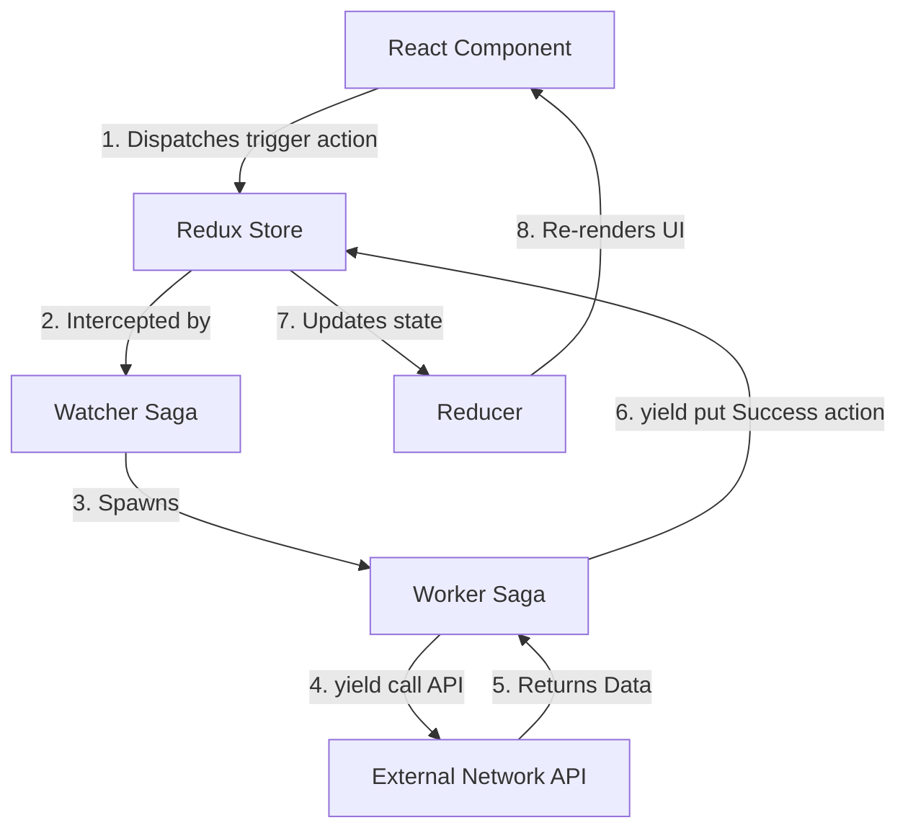
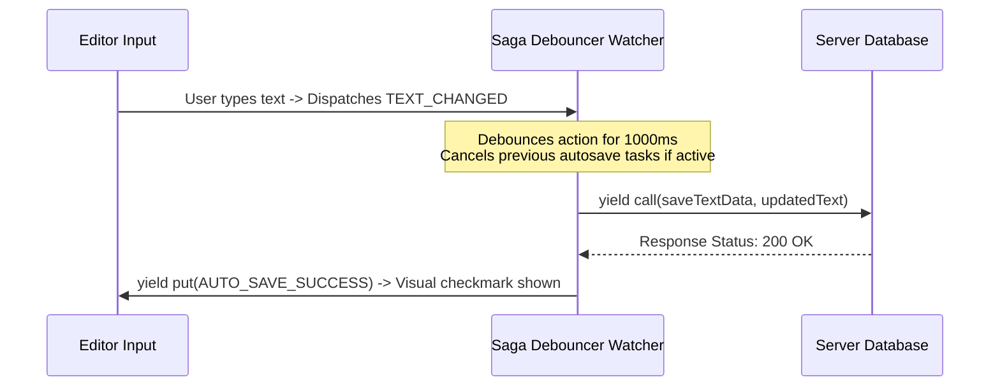

# Redux Saga

Redux Saga is a middleware that uses ES6 Generators (functions with `function*` syntax) to make asynchronous side-effects (like data fetching and browser caching) easier to manage, execute, write, and test.

---

## Dependencies
```bash
npm install redux-saga
```

---

## Configuration
Setup saga middleware, combine saga generators, and launch watcher tasks.
```typescript
import createSagaMiddleware from 'redux-saga';
const sagaMiddleware = createSagaMiddleware();
const store = createStore(reducer, applyMiddleware(sagaMiddleware));
sagaMiddleware.run(rootSaga);
```

---

## Implementation Steps
1. **Watcher Saga**: Write a generator function listening to trigger actions (e.g. `takeLatest(FETCH_REQUEST, fetchWorker)`).
2. **Worker Saga**: Implement side-effect generator code (use `call` for promises, and `put` to dispatch final actions).
3. **Register Root Saga**: Combine all watcher sagas into a single generator running task loop.

---

## Saga Architecture Chart


---

## Realistic Example: Auto-Saving Document Logs

