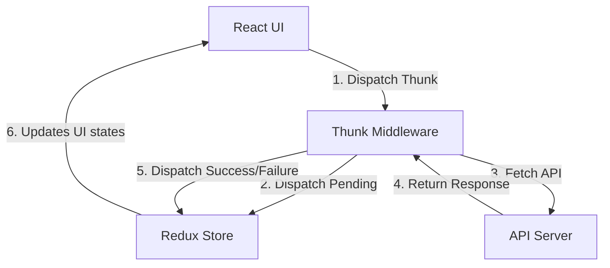
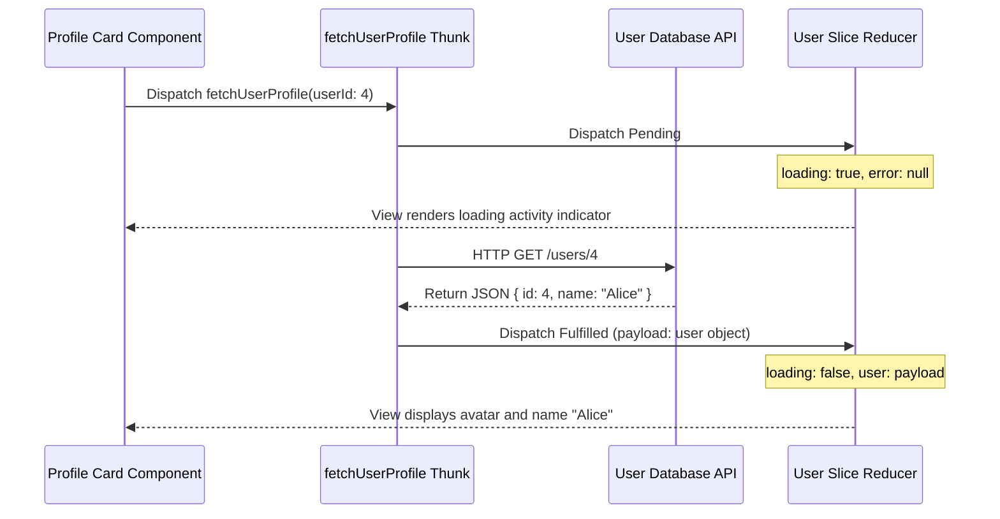

# Redux Thunk

Redux Thunk is a middleware that allows you to write action creators that return a function (a thunk) instead of a plain action object. This function can perform asynchronous tasks (e.g. API requests) and dispatch standard actions when complete.

---

## Dependencies
RTK includes Redux Thunk by default. For legacy Redux:
```bash
npm install redux-thunk
```

---

## Configuration
If using RTK, no configuration is needed. For legacy Redux, apply middleware:
```typescript
import { applyMiddleware, createStore } from 'redux';
import { thunk } from 'redux-thunk';
const store = createStore(reducer, applyMiddleware(thunk));
```

---

## Implementation Steps
1. **Declare Thunk Action**: Define an action creator using `createAsyncThunk()` (RTK) that performs async fetching.
2. **Handle States in Reducers**: Map `pending`, `fulfilled`, and `rejected` lifecycle cases inside the slice's `extraReducers` callback.
3. **Dispatch & Display**: Dispatch the thunk action and display loader spinners during fetch states.

---

## Thunk Execution Chart


---

## Realistic Example: Fetching Profile Cards

