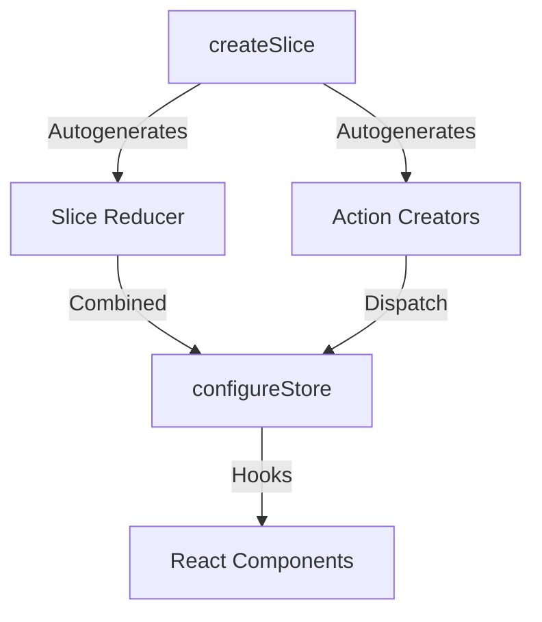

# Redux Toolkit (RTK)

Redux Toolkit is the official, opinionated, batteries-included toolset for efficient Redux development. It was created to address common complaints of boilerplate and complex configuration in simple Redux.

---

## Dependencies
```bash
npm install @reduxjs/toolkit react-redux
```

---

## Configuration
Configure slices inside a slice file, then combine them using `configureStore()`.

---

## Implementation Steps
1. **Create Slices**: Use `createSlice()` from RTK. Declare slice name, initial state, and write reducer functions (Immer handles immutability automatically).
2. **Setup Store**: Add slices into `configureStore()`.
3. **Dispatch Slices**: Import actions directly from `slice.actions` and dispatch them in components.

---

## Slice Architecture Chart


---

## Realistic Example: Dark Mode User Preference
```mermaid
graph TD
    UI[Toggle Theme Button] -->|dispatch toggleTheme| Action[theme/toggleTheme action]
    Action -->|Triggers| Reducer[Theme Reducer]
    Note over Reducer: state.isDarkMode = !state.isDarkMode<br/>(Immer handles immutable update)
    Reducer -->|Updates Store| Store[Theme StoreState]
    Store -->|Subscribers notified| Views[App Container layout changes colors]
```
