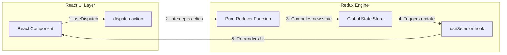
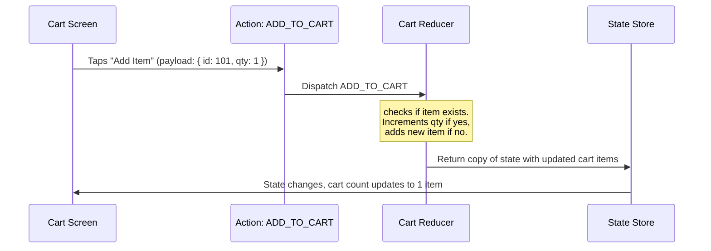

# Simple Redux

Simple (or Classic) Redux is a predictable state container for JavaScript apps. It uses a single global store, actions, and pure functions called reducers to update the state.

---

## Dependencies
```bash
npm install redux react-redux
```

---

## Implementation Steps
1. **Define Types & Actions**: Set constant string types and create action objects.
2. **Create a Reducer**: Build a pure function that calculates new state based on action types.
3. **Configure the Store**: Instantiate `createStore(reducer)`.
4. **Link to React**: Wrap your root component in `<Provider store={store}>` and use `useSelector` (to read state) and `useDispatch` (to dispatch actions).

---

## Architectural Data Flow (Concept Chart)


---

## Realistic Example: Shopping Cart Update

