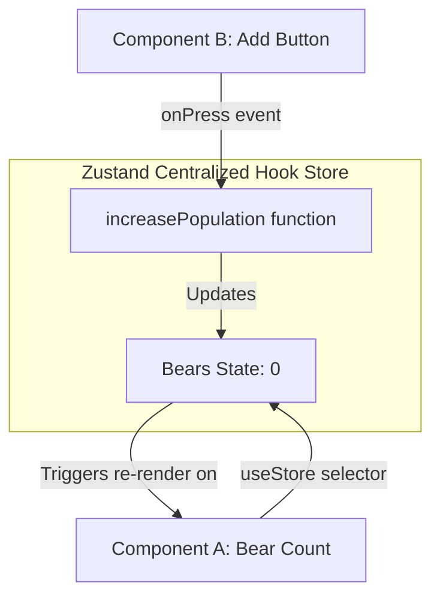
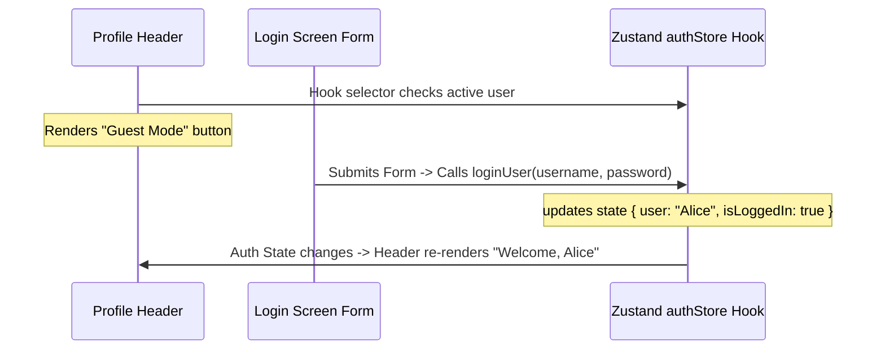

# Zustand

Zustand is a small, fast, and scalable barebones state-management solution using simplified Hook patterns. It has a tiny footprint and solves common react state problems (such as zombie child problems, react concurrency, and context loss) without boilerplate.

---

## Dependencies
```bash
npm install zustand
```

---

## Implementation Steps
1. **Define Store**: Call `create()` to construct a state hook. Declare properties and update functions inside the hook closure.
2. **Access States**: Hook directly into components (e.g. `const bears = useBearStore(state => state.bears)`).
3. **Fire Updates**: Call update functions directly from the hook without providers.

---

## Zustand Data Flow Chart


---

## Realistic Example: Global User Login Profile

