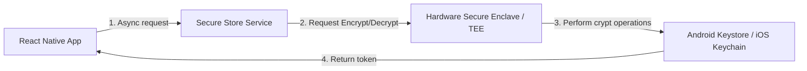
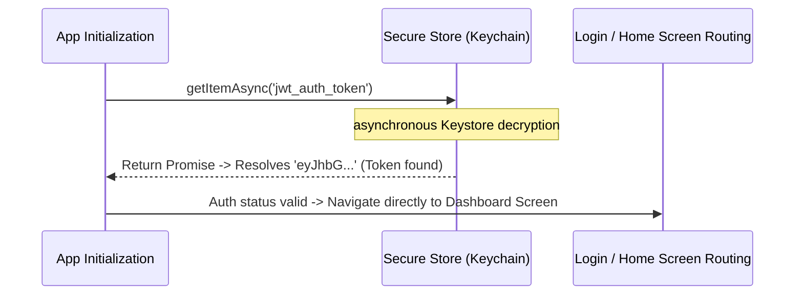

# Secure Storage (expo-secure-store)

Secure Storage is a system service that encrypts data before storing it in a persistent, secure keystore on the device. It utilizes the iOS Keychain and Android Keystore system, protecting sensitive credentials from being accessed on rooted devices.

---

## Dependencies
```bash
npx expo install expo-secure-store
```

---

## Implementation Steps
1. **Asynchronous Write**: Encrypt and store data asynchronously using:
   ```typescript
   await SecureStore.setItemAsync('key', 'value');
   ```
2. **Asynchronous Read**: Fetch and decrypt data using:
   ```typescript
   const value = await SecureStore.getItemAsync('key');
   ```
3. **Delete Secrets**: Remove items using:
   ```typescript
   await SecureStore.deleteItemAsync('key');
   ```

---

## Security Model: Keystore / Keychain



---

## Realistic Example: App Bootstrapping Token Check

This flowchart demonstrates how an application checks auth states during startup, utilizing **Secure Store** for credentials.


