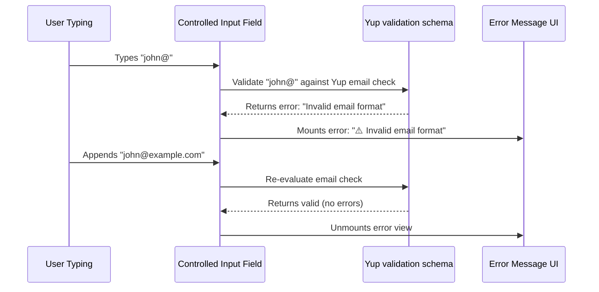

# Formik & Yup

Formik is a popular, declarative form management library using standard **controlled components**. It is often paired with **Yup**, a JavaScript schema builder for value parsing and validation, allowing developers to define schemas and validate objects against them.

---

## Dependencies

```bash
# Form Management & Validation
npm install formik yup
```

---

## Configuration & Integration
Formik supports schema validation out of the box via the `validationSchema` property.

```typescript
import { Formik } from 'formik';
import * as Yup from 'yup';

const validationSchema = Yup.object().shape({
    email: Yup.string().email('Invalid email').required('Email required'),
});

<Formik
    initialValues={{ email: '' }}
    validationSchema={validationSchema}
    onSubmit={values => console.log(values)}
>
    {/* Form inputs */}
</Formik>
```

---

## Implementation Steps
1. **Declare wrapper**: Render the `<Formik>` provider, setting initial values and validation schemas.
2. **Bind inputs**: Connect fields manually using Formik context methods (`handleChange`, `handleBlur`, `values`, `errors`).
3. **Submit**: Connect validation states to the form submit trigger.

---

## Controlled State Render Model (Formik)

```mermaid
graph TD
    User[User types character 'A'] -->|1. Updates state| Change[handleChange]
    Change -->|2. Call setState| State[React Form state updates]
    State -->|3. Trigger re-render| UI[Entire Form Component Tree]
    Note over UI: Renders the entire form tree,<br/>re-checking all inputs.
```

---

## Realistic Example: Real-time Email validation

This sequence explains how validations run when a user types inside a Formik form input.


