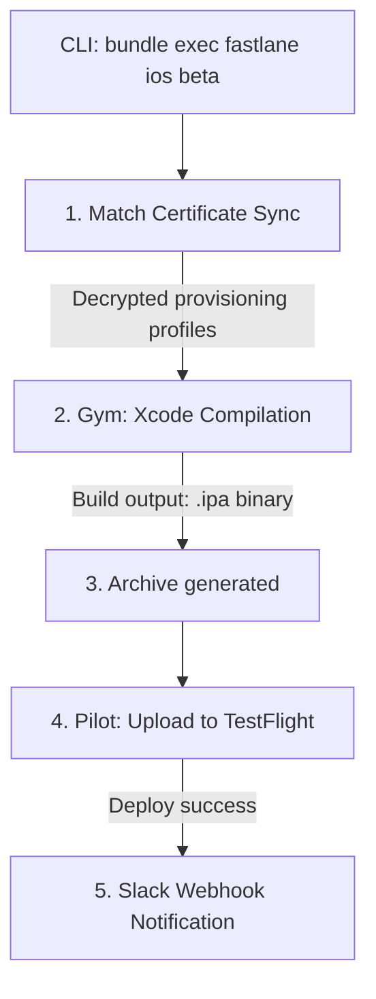
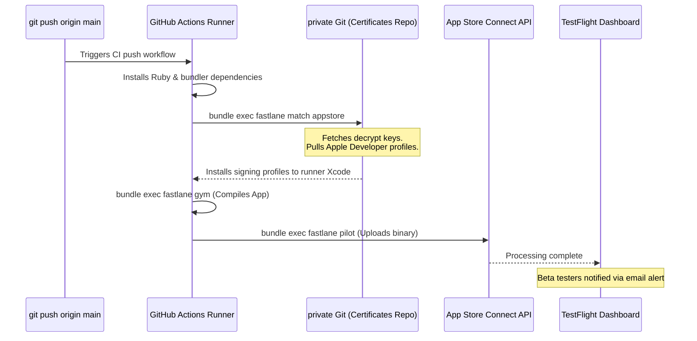

# CI/CD Automation: Fastlane

Fastlane is an open-source tool suite written in Ruby that automates the tedious tasks of mobile app deployment, such as compiling binaries, managing signing credentials, and uploading builds to the App Store and Google Play Store.

---

## Prerequisites & Dependencies

Fastlane is built on Ruby. Install via **Bundler** to guarantee version lock-ins across CI systems.

### 1. Create a `Gemfile` inside the project root:
```ruby
source "https://rubygems.org"
gem "fastlane"
```

### 2. Install Ruby gems:
```bash
bundle install
```

---

## Configuration & Launch Steps

1. **Initialize Fastlane**: Run `bundle exec fastlane init` inside the project platform folder (e.g. `ios/` or `android/`).
2. **Setup Match Credentials**: Configure code-signing certificates.
   ```bash
   bundle exec fastlane match init
   ```
   Follow prompts to connect a private Git repository for certificate storage.
3. **Draft lanes**: Edit `fastlane/Fastfile` to specify steps for compiling and signing binaries.

---

## Fastlane Automation Compilation Pipelines



---

## Realistic Example: CI Runner Deployment Flow (GitHub Actions)

This flowchart illustrates how a continuous integration system executes Fastlane pipelines to build and deploy iOS releases automatically.


